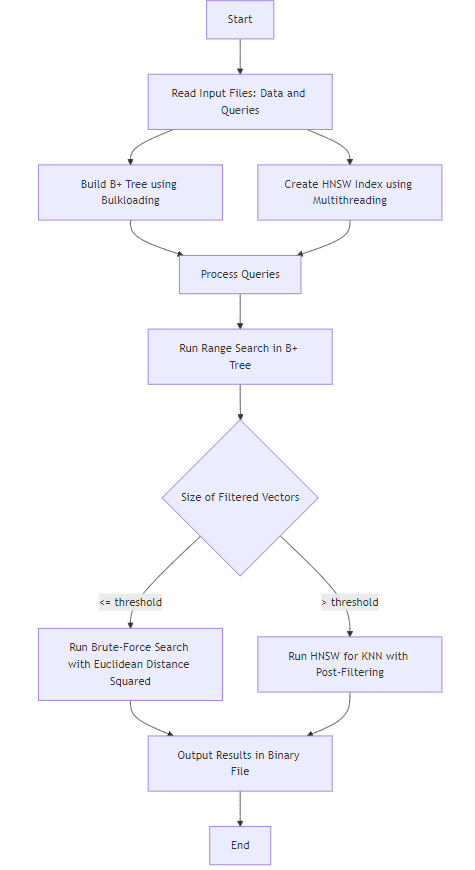

# Enhanced KNN Search for Range Queries with HNSW and B+ Tree Indexing
[](https://isocpp.org)
[](https://github.com/nmslib/hnswlib)
[](https://graphviz.org)


## Table of Contents
  - [Project Overview](#project-overview)
  - [Features](#features)
  - [Setup and Installation](#setup-and-installation)
    - [Prerequisites](#prerequisites)
    - [Steps to Run](#steps-to-run)
    - [Input and Output](#input-and-output)
  - [Bulkloading Algorithm for B+ Tree Construction](#bulkloading-algorithm-for-b-tree-construction)
    - [Visualization](#visualization)
  - [HNSWLib Integration](#hnswlib-integration)
    - [Query Processing](#query-processing)
    - [System Workflow](#system-workflow)
  - [Performance Evaluation](#performance-evaluation)
    - [Metrics](#metrics)
    - [Parameter Tuning](#parameter-tuning)
    - [Further Improvements](#further-improvements)
  - [Resources](#resources)

## Project Overview

This project enhances the filtering mechanism of HNSWLib’s brute-force Approximate Nearest Neighbor (ANN) index by integrating a B+ tree for efficient pre-filtering based on attribute ranges. The B+ tree narrows down the search space by selecting points that meet filter criteria (e.g., attributes within a specified range). After filtering, the system decides the next steps:

1. **Brute-Force Search**: If the filtered subset is small, a brute-force nearest neighbor search is performed.
2. **ANN Search**: If the subset is large, HNSW (Hierarchical Navigable Small World) is used for ANN search, followed by post-filtering.

This approach leverages the power of both exact and approximate search techniques to optimize performance across different search space sizes.

## Features

- **B+ Tree Integration**: A B+ tree is implemented to efficiently filter data points based on given attribute ranges. The B+ tree supports **bulkloading**, which optimizes the tree construction process for large datasets. Additionally, the B+ tree can be **visualized using Graphviz**, providing an intuitive way to inspect the tree structure.
- **HNSWLib Integration**: The HNSWLib library is used for ANN search, with support for **multithreading** to improve index creation speed and query performance.
- **Brute-force and ANN Search**: Depending on the size of the filtered data subset, either a brute-force search using Euclidean distance squared or an ANN search with post-filtering is executed.
- **Flexible Query Processing**: The program takes two binary files (data and queries), and processes them through a pipeline that includes building the B+ tree, running queries, and generating an output binary file containing the IDs of the nearest neighbors for each query.

## Setup and Installation

### Prerequisites

- Ensure that **make** is installed on your system to build the project.
- The project is developed in **C++** and depends on the external libraries **HNSWLib** and **Graphviz** for functionality.

### Steps to Run

1. Clone the repository:

   ```bash
   git clone https://github.com/imanerh/BPlusVectorSearch.git
   cd BPlusVectorSearch
   ```

2. Build the project:

   ```bash
   make
   ```

3. Run the program with your binary files:

   ```bash
   make run SOURCE_PATH=data.bin QUERY_PATH=queries.bin KNN_SAVE_PATH=output/output.bin
   ```

### Input and Output

- **Input Files**: The program expects two binary files:
  - `data.bin`: Contains the data points.
  - `queries.bin`: Contains the queries to be processed.
  
- **Output File**: The program generates an output file (`output.bin`) that contains the IDs of the KNN that satisfy the range for each query.

## Bulkloading Algorithm for B+ Tree Construction

To construct the B+ tree efficiently from scratch, we used the **bulkloading algorithm**, which is more efficient than the standard insertion procedure. This method reduces the number of tree traversals required during insertion. The steps involved in the bulkloading process are:

1. **Sort the data** based on the key that the index will be built on.
2. **Fill the leaf pages** up to a certain fill factor `f`.
3. **Add parent-child pointers**: A pointer is added from the parent node to the leaf page. If the parent overflows, split the parent into two nodes:
   - Keep `d` entries in the first node (L1), which means that `d+1` entries will go into the second node (L2).
   - Since the parent node has overflowed, move the first entry from L2 into the parent node.
4. **Adjust pointers**

This approach ensures that the B+ tree is built efficiently with minimal overhead during construction.

### Visualization

The B+ tree is visualized using **Graphviz**, which provides a graphical representation of the tree structure.

*Example Image: B+ Tree Structure illustrated using the bulkloading example from the lecture.*


## HNSWLib Integration

The project integrates **HNSWLib** for Approximate Nearest Neighbor (ANN) search, with **multithreading** implemented to accelerate the index creation process.


The choice of parameters for HNSW are:
- `M=24`: The range of `M` is between 12 and 48 as suggested by the HNSWLib documentation, and this value has been selected based on empirical testing.
- `ef_construction=140`: While no rule exists for setting `ef_construction`, this value was chosen after measuring recall during testing.

### Query Processing

For each query, the following steps are performed:

1. The B+ tree is used to search for elements within the specified range.
2. If the subset is small, a **brute-force search** using squared Euclidean distance is applied.
3. If the subset is large, **HNSW** is used for KNN search with a `k` larger than the desired number of neighbors to ensure that enough points are within range. Post-filtering is then applied to discard any points that do not satisfy the range.

### System Workflow

<!--  -->


## Performance Evaluation

### Metrics

The primary metrics used to evaluate performance are:

- **Queries per Second (QPS)**: Measures the speed of processing queries.
- **Recall**: Measures the accuracy of the nearest neighbors returned by the system.

### Parameter Tuning

The following parameters were varied during testing:

- **Order of B+ Tree**
- **M** (parameter of HNSW)
- **ef_construction** (parameter of HNSW)
- **K_init** (initial number of neighbors)
- **threshold** (limit for filtered data size)

The tests were conducted using empirically chosen discrete values to observe how the QPS and recall metrics varied with changes in the parameters. Future work will focus on more rigorous testing and providing mathematical justification for optimal parameter selection.

The following tests represent a subset of the experiments conducted, using the fixed parameters outlined below:
- **Order** = 100  
- **K_init** = 2000  
- **M** = 24  
- **ef_construction** = 140  
  
The data used for these experiments includes `dummy-data.bin` with $10^4$ vectors and `dummy-queries.bin` with 100 queries, both of which are available in [Resource 5](#resources).
The threshold was varied to observe changes in **QPS** and **Recall**.

Additional metrics from the setup:

- **Bulkloading Time**: 4 ms
- **Time to Build the HNSW Index**: 2038 ms
- **Duration to Process All Queries**: 177 ms


| Threshold | Search Method   | QPS  | Recall     |
|-----------|-----------------|------|------------|
| 0         | Only HNSW       | 265  | 1          |
| 500         | Hybrid       | 261  | 1          |
| 1000         | Hybrid       | 217  | 1          |
| 1500         | Hybrid       | 283  | 1          |
| 2000         | Hybrid       | 288  | 1          |
| 2500         | Hybrid       | 265  | 1          |
| 4000         | Hybrid       | 206  | 1          |
| 5000         | Hybrid       | 198  | 1          |
| inf       | Only Bruteforce | 225  | 1          |

### Further Improvements

- Fine-tuning the above parameters for optimal performance.
- Additional tests to justify parameter choices mathematically.

## Resources  
<sup>[1]</sup> [B+ Tree GitHub](https://github.com/niteshkumartiwari/B-Plus-Tree) – Inspired the B+ tree implementation.  
<sup>[2]</sup> [HNSW Paper](https://arxiv.org/abs/1603.09320) – Paper detailing the HNSW algorithm.  
<sup>[3]</sup> [HNSWLib GitHub](https://github.com/nmslib/hnswlib) – Core library for HNSW.  
<sup>[4]</sup> [Multithreaded HNSW Example](https://github.com/nmslib/hnswlib/blob/master/examples/cpp/example_mt_search.cpp)  
<sup>[5]</sup> [Data and File Structure Information](https://dbgroup.cs.tsinghua.edu.cn/sigmod2024/task.shtml?content=description)  
